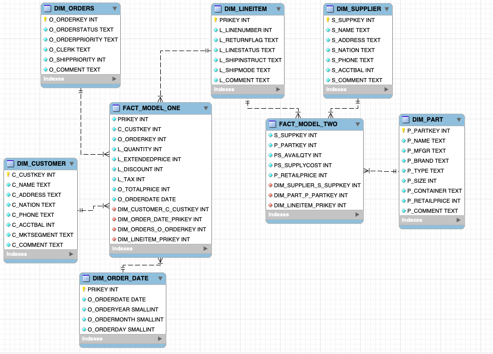
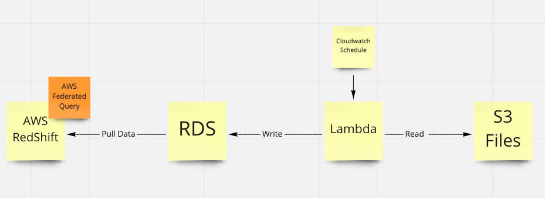

# Beerwulf.Data.Assessment - Data Engineer Interview Assessment

This file will include all the relevant information, reference code files name (.py and .sql), and assumptions (if any) I made during this assignment. 

Below I have described all the answers,

1. Extract `data.zip`, upload data to SQL DB by using Python.

To full fill above step, I have written two scripts.
* `etl_scripts.py`

* `etl_job.py`

`etl_scripts` includes all the functions used by `etl_job` to extract zip, establish the connection, and upload data to SQL from the local machine (where data is saved temporarily) by using Python.

2. Design a star schema model with facts and dimensions, generate the load scripts to populate the schema. Provide the load scripts, alongside an Entity Relationship Diagram (You can use any of the online ERD softwares available, export an image and upload it). 

The below Entity Relationship Diagram represents the design of star schema with facts and dimensions.

Two fact tables and six dimension tables are created.

The load script is called `star_schema.sql`. The script will populate the fact and dimension table inside the star schema.

**Extra** point: 
1 define a classification (it can be anything you want) for breaking the customer account balances into 3 logical groups
2 add a field for this new classification
3 add revenue per line item

For the extra point question, I have merged 1 and 2 together. And the SQL code is located in `extra_point.sql`.
To perform the classification for questions 1 and 2, I've categorized customers based on their balance. 
If the balance is negative, I marked the customer as "Negative Balance Customer", If the balance is between 0 to 5000 $/euro, the customer is marked as "Moderate Balance Customer." If the balance is more than 5000, then the customer is marked as "Target Customer". I assumed that if a customer has a balance of more than 5K, the company can target him to purchase more stuff.

For question 3, I was not sure what do you want, but I have written a query that adds revenue in the line item column.

#### Considering the Microsoft Azure Data Stack, answer the questiosn below:

Having experience in AWS and a similar project experience, I would like to answer these questions using AWS resources. 

3. Describe how you can schedule this process to run multiple times per day.

AWS offers cloud watch, where the job can be scheduled according to the requirement. Also, Airflow is another option which can use for job scheduling purpose. dbt can also be used for transformation purposes.
 
**Extra** point: 
- What would you do to cater for data arriving in random order?

I would use the AWS S3 bucket to cater to the data arriving in random order. 

- What about if the data comes from a stream, and arrives at random times?

If the data is coming via stream, the data can be saved in the S3 bucket with the use of the AWS Kinesis stream. 
Before processing the data, the cloud watch can scan the data in the s3 bucket. The data can be processed/transformed to AWS RDS with the AWS Lambda if the complete data is present. And from the AWS RDS, data can be pushed to the AWS Redshift data warehouse to deliver insights to end-users.

4. Describe how you would deploy your code to production, and allow for future maitenance. 

To deploy the code in production, the AWS container service can be used. Or the code can be deployed on an EC2 instance. It will make it easy to perform maintenance on code.

5. A Data Warehouse is highly used to deliver insights to end-users from different departments. Can you use the designed star schema to come up with optimized SQL statements to answer the following questions:

   a. What are the bottom 3 nations in terms of revenue?
 
   b. From the top 3 nations, what is the most common shipping mode?

   c. What are the top 5 selling months?

   d. Who are the top customer(s) in terms of either revenue or quantity?

   e. Compare the sales revenue on a financial year-to-year (01 July to 30 June) basis.

The queries used to solve the above question are located in the SQL file `Data_Warehouse.sql`.

ERD
--

